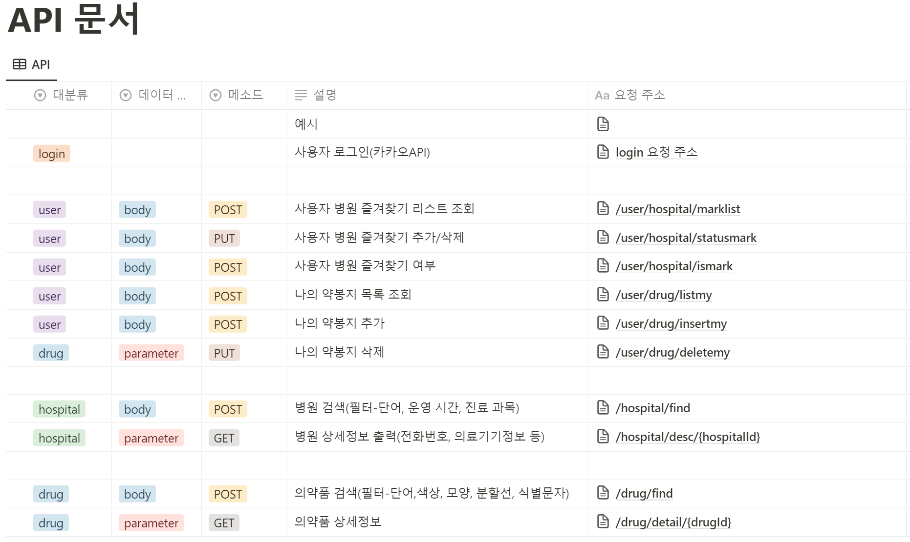

# API 명세서



## 명세서 상세보기

```json
{
  "info": {
    "_postman_id": "f41acb66-add8-4745-93b0-9270696339cd",
    "name": "Matdoc",
    "schema": "https://schema.getpostman.com/json/collection/v2.1.0/collection.json",
    "_exporter_id": "25115561"
  },
  "item": [
    {
      "name": "병원찾기",
      "request": {
        "method": "POST",
        "header": [],
        "body": {
          "mode": "raw",
          "raw": {
            "word": "광명",
            "e": 126.9622,
            "w": 126.944,
            "s": 37.2154,
            "n": 37.2231,
            "hour": 1,
            "min": 30,
            "day": 2,
            "part": [100],
            "open": [0]
          },
          "options": {
            "raw": {
              "language": "json"
            }
          }
        },
        "url": {
          "raw": "http://localhost:8080/hospital/find",
          "protocol": "http",
          "host": ["localhost"],
          "port": "8080",
          "path": ["hospital", "find"]
        }
      },
      "response": [
        {
          "status": "OK",
          "code": 200,
          "_postman_previewlanguage": "json",
          "header": [
            {
              "key": "Vary",
              "value": "Origin"
            },
            {
              "key": "Vary",
              "value": "Access-Control-Request-Method"
            },
            {
              "key": "Vary",
              "value": "Access-Control-Request-Headers"
            },
            {
              "key": "Content-Type",
              "value": "application/json"
            },
            {
              "key": "Transfer-Encoding",
              "value": "chunked"
            },
            {
              "key": "Date",
              "value": "Fri, 07 Jul 2023 09:31:42 GMT"
            },
            {
              "key": "Keep-Alive",
              "value": "timeout=60"
            },
            {
              "key": "Connection",
              "value": "keep-alive"
            }
          ],
          "cookie": [],
          "body": {
            "status_code": 200,
            "message": "필터로 병원찾기 목록",
            "data": [
              {
                "hospitalId": 63566,
                "hospitalName": "광명한의원",
                "hospitalOpen": false,
                "hospitalCode": "한의원",
                "hospitalTel": "031-297-1475",
                "hospitalX": 126.9591576,
                "hospitalY": 37.2162972,
                "hospitalTime": [
                  "09:30~19:00",
                  "09:30~19:00",
                  "09:30~19:00",
                  "09:30~19:00",
                  "09:30~19:00",
                  "휴진",
                  "휴진",
                  "휴진"
                ],
                "hospitalPart": [
                  "한방내과",
                  "0",
                  "한방부인과",
                  "0",
                  "한방소아과",
                  "0",
                  "한방안·이비인후·피부과",
                  "0",
                  "한방신경정신과",
                  "0",
                  "침구과",
                  "0",
                  "한방재활의학과",
                  "0",
                  "사상체질과",
                  "0",
                  "한의원",
                  "0"
                ]
              }
            ]
          }
        }
      ]
    },
    {
      "name": "http://localhost:8080/hospital/desc/19480",
      "request": {
        "method": "GET",
        "header": [],
        "url": {
          "raw": "http://localhost:8080/hospital/desc/19010",
          "protocol": "http",
          "host": ["localhost"],
          "port": "8080",
          "path": ["hospital", "desc", "19010"]
        }
      },
      "response": [
        {
          "status": "OK",
          "code": 200,
          "_postman_previewlanguage": "json",
          "header": [
            {
              "key": "Vary",
              "value": "Origin"
            },
            {
              "key": "Vary",
              "value": "Access-Control-Request-Method"
            },
            {
              "key": "Vary",
              "value": "Access-Control-Request-Headers"
            },
            {
              "key": "Content-Type",
              "value": "application/json"
            },
            {
              "key": "Transfer-Encoding",
              "value": "chunked"
            },
            {
              "key": "Date",
              "value": "Fri, 07 Jul 2023 09:34:57 GMT"
            },
            {
              "key": "Keep-Alive",
              "value": "timeout=60"
            },
            {
              "key": "Connection",
              "value": "keep-alive"
            }
          ],
          "cookie": [],
          "body": {
            "status_code": 200,
            "message": "병원 상세보기",
            "data": {
              "hospitalId": 19010,
              "hospitalAdd": "서울특별시 강남구 테헤란로 310 두꺼비빌딩 3층 (역삼동)",
              "hospitalParking": 8,
              "hospitalDevice": "초음파영상진단기/콘빔CT",
              "hospitalSpecial": "소아야간진료(20시 이후)"
            }
          }
        }
      ]
    },
    {
      "name": "http://localhost:8080/drug/find",
      "request": {
        "method": "POST",
        "header": [],
        "body": {
          "mode": "raw",
          "raw": {
            "name": "이지엔",
            "colors": "파랑",
            "type": "타원형",
            "line": "",
            "mark": "eve"
          },
          "options": {
            "raw": {
              "language": "json"
            }
          }
        },
        "url": {
          "raw": "http://localhost:8080/drug/find",
          "protocol": "http",
          "host": ["localhost"],
          "port": "8080",
          "path": ["drug", "find"]
        }
      },
      "response": [
        {
          "status": "OK",
          "code": 200,
          "_postman_previewlanguage": "json",
          "header": [
            {
              "key": "Vary",
              "value": "Origin"
            },
            {
              "key": "Vary",
              "value": "Access-Control-Request-Method"
            },
            {
              "key": "Vary",
              "value": "Access-Control-Request-Headers"
            },
            {
              "key": "Content-Type",
              "value": "application/json"
            },
            {
              "key": "Transfer-Encoding",
              "value": "chunked"
            },
            {
              "key": "Date",
              "value": "Fri, 07 Jul 2023 09:38:55 GMT"
            },
            {
              "key": "Keep-Alive",
              "value": "timeout=60"
            },
            {
              "key": "Connection",
              "value": "keep-alive"
            }
          ],
          "cookie": [],
          "body": {
            "status_code": 200,
            "message": "필터를 통한 의약품 검색 성공",
            "data": [
              {
                "drugId": 11721,
                "drugName": "이지엔6이브연질캡슐",
                "drugImg": "d145s62oycon3s.cloudfront.net/11721.png",
                "drugMarkf": "EVE",
                "drugMarkb": "-",
                "drugType": "타원형",
                "drugColorf": "파랑|투명",
                "drugColorb": "-",
                "drugLine": "oxo",
                "drugIngre": "이부프로펜|파마브롬"
              }
            ]
          }
        }
      ]
    },
    {
      "name": "http://localhost:8080/drug/detail/11721",
      "request": {
        "method": "GET",
        "header": [],
        "url": {
          "raw": "http://localhost:8080/drug/detail/11721",
          "protocol": "http",
          "host": ["localhost"],
          "port": "8080",
          "path": ["drug", "detail", "11721"]
        }
      },
      "response": [
        {
          "status": "OK",
          "code": 200,
          "_postman_previewlanguage": "json",
          "header": [
            {
              "key": "Vary",
              "value": "Origin"
            },
            {
              "key": "Vary",
              "value": "Access-Control-Request-Method"
            },
            {
              "key": "Vary",
              "value": "Access-Control-Request-Headers"
            },
            {
              "key": "Content-Type",
              "value": "application/json"
            },
            {
              "key": "Transfer-Encoding",
              "value": "chunked"
            },
            {
              "key": "Date",
              "value": "Fri, 07 Jul 2023 09:39:54 GMT"
            },
            {
              "key": "Keep-Alive",
              "value": "timeout=60"
            },
            {
              "key": "Connection",
              "value": "keep-alive"
            }
          ],
          "cookie": [],
          "body": {
            "status_code": 200,
            "message": "의약품 상세정보 조회 성공",
            "data": {
              "drugId": 11721,
              "drug": {
                "drugId": 11721,
                "drugName": "이지엔6이브연질캡슐",
                "drugImg": "d145s62oycon3s.cloudfront.net/11721.png",
                "drugMarkf": "EVE",
                "drugMarkb": "-",
                "drugType": "타원형",
                "drugColorf": "파랑|투명",
                "drugColorb": "-",
                "drugLine": "oxo",
                "drugIngre": "이부프로펜|파마브롬"
              },
              "desc": {
                "drugId": 11721,
                "drugDescCat": "해열.진통.소염제",
                "drugDescShape": "무색내지연한청색의투명한내용물을함유한청색의투명한타원형연질캡슐",
                "drugDescCom": "(주)대웅제약",
                "drugDescSafety": "이약에과민증환자및경험자| 다른해열진통제|감기약복용시천식을일으킨적이있는사람| 만3개월미만의영아는이약을복용하지마십시오.이약을복용하기전에 수두또는인플루엔자에감염되어있거나또는의심되는영아및만15세미만의어린이| 만1세미만의영아| 두드러기|접촉성피부염|기관지천식|알레르기성비염|편두통|음식물알레르기등을일으키기쉬운체질|약에의해알레르기증상(예:발열|발진|관절통|천식|가려움증등)경험자|간장질환|신장질환|갑상선질환|당뇨병|고혈압등이있는사람|몸이약한사람또는고열이있는사람| 고령자| 임부또는임신하고있을가능성이있는여성|수유부|속쓰림|위부불쾌감|위통과같은위장문제가지속혹은재발되거나궤양|출혈문제를가지고있는사람| 구토와설사로많은수분을손실하거나수분을흡수하지않는사람은의사또는약사와상의하십시오.정해진용법과용량을잘지키십시오.5~6회복용하여도증상이좋아지지않을경우 복용을즉각중지하고의사또는약사와상의하십시오.",
                "drugDescEffect": "이약은두통|치통|발치(이를뽑음)후동통(통증)|인후(목구멍)통|귀의통증|관절통|신경통|요(허리)통|근육통|견통(어깨통증)|타박통|골절통|염좌통(삔통증)|생리통|외상(상처)통의진통|오한|발열시의해열에사용합니다.",
                "drugDescUse": "만8세이상~만15세미만은1회1캡슐1일1~3회|만15세이상또는성인은1회1~2캡슐1일1~3회공복(빈속)시를피하여복용하며복용간격은4시간이상으로합니다."
              },
              "avoid": []
            }
          }
        }
      ]
    },
    {
      "name": "http://localhost:8080/user/hospital/statusmark",
      "request": {
        "method": "PUT",
        "header": [],
        "body": {
          "mode": "raw",
          "raw": {
            "userId": 1,
            "hospitalId": 19480
          },
          "options": {
            "raw": {
              "language": "json"
            }
          }
        },
        "url": {
          "raw": "http://localhost:8080/user/hospital/statusmark",
          "protocol": "http",
          "host": ["localhost"],
          "port": "8080",
          "path": ["user", "hospital", "statusmark"]
        }
      },
      "response": [
        {
          "status": "OK",
          "code": 200,
          "_postman_previewlanguage": "json",
          "header": [
            {
              "key": "Vary",
              "value": "Origin"
            },
            {
              "key": "Vary",
              "value": "Access-Control-Request-Method"
            },
            {
              "key": "Vary",
              "value": "Access-Control-Request-Headers"
            },
            {
              "key": "Content-Type",
              "value": "application/json"
            },
            {
              "key": "Transfer-Encoding",
              "value": "chunked"
            },
            {
              "key": "Date",
              "value": "Fri, 07 Jul 2023 09:44:31 GMT"
            },
            {
              "key": "Keep-Alive",
              "value": "timeout=60"
            },
            {
              "key": "Connection",
              "value": "keep-alive"
            }
          ],
          "cookie": [],
          "body": {
            "status_code": 200,
            "message": "병원 즐겨찾기 등록 완료",
            "data": true
          }
        },
        {
          "status": "OK",
          "code": 200,
          "_postman_previewlanguage": "json",
          "header": [
            {
              "key": "Vary",
              "value": "Origin"
            },
            {
              "key": "Vary",
              "value": "Access-Control-Request-Method"
            },
            {
              "key": "Vary",
              "value": "Access-Control-Request-Headers"
            },
            {
              "key": "Content-Type",
              "value": "application/json"
            },
            {
              "key": "Transfer-Encoding",
              "value": "chunked"
            },
            {
              "key": "Date",
              "value": "Fri, 07 Jul 2023 09:44:41 GMT"
            },
            {
              "key": "Keep-Alive",
              "value": "timeout=60"
            },
            {
              "key": "Connection",
              "value": "keep-alive"
            }
          ],
          "cookie": [],
          "body": {
            "status_code": 200,
            "message": "병원 즐겨찾기 삭제 완료",
            "data": false
          }
        }
      ]
    },
    {
      "name": "http://localhost:8080/user/hospital/ismark",
      "request": {
        "method": "POST",
        "header": [],
        "body": {
          "mode": "raw",
          "raw": {
            "userId": 1,
            "hospitalId": 19480
          },
          "options": {
            "raw": {
              "language": "json"
            }
          }
        },
        "url": {
          "raw": "http://localhost:8080/user/hospital/ismark",
          "protocol": "http",
          "host": ["localhost"],
          "port": "8080",
          "path": ["user", "hospital", "ismark"]
        }
      },
      "response": [
        {
          "status": "OK",
          "code": 200,
          "_postman_previewlanguage": "json",
          "header": [
            {
              "key": "Vary",
              "value": "Origin"
            },
            {
              "key": "Vary",
              "value": "Access-Control-Request-Method"
            },
            {
              "key": "Vary",
              "value": "Access-Control-Request-Headers"
            },
            {
              "key": "Content-Type",
              "value": "application/json"
            },
            {
              "key": "Transfer-Encoding",
              "value": "chunked"
            },
            {
              "key": "Date",
              "value": "Fri, 07 Jul 2023 09:45:25 GMT"
            },
            {
              "key": "Keep-Alive",
              "value": "timeout=60"
            },
            {
              "key": "Connection",
              "value": "keep-alive"
            }
          ],
          "cookie": [],
          "body": {
            "status_code": 200,
            "message": "즐겨찾기한 병원입니다.",
            "data": true
          }
        },
        {
          "status": "OK",
          "code": 200,
          "_postman_previewlanguage": "json",
          "header": [
            {
              "key": "Vary",
              "value": "Origin"
            },
            {
              "key": "Vary",
              "value": "Access-Control-Request-Method"
            },
            {
              "key": "Vary",
              "value": "Access-Control-Request-Headers"
            },
            {
              "key": "Content-Type",
              "value": "application/json"
            },
            {
              "key": "Transfer-Encoding",
              "value": "chunked"
            },
            {
              "key": "Date",
              "value": "Fri, 07 Jul 2023 09:45:54 GMT"
            },
            {
              "key": "Keep-Alive",
              "value": "timeout=60"
            },
            {
              "key": "Connection",
              "value": "keep-alive"
            }
          ],
          "cookie": [],
          "body": {
            "status_code": 204,
            "message": "즐겨찾기한 병원이 아닙니다.",
            "data": false
          }
        }
      ]
    },
    {
      "name": "http://localhost:8080/user/hospital/marklist",
      "request": {
        "method": "POST",
        "header": [],
        "body": {
          "mode": "raw",
          "raw": {
            "hour": 12,
            "min": 0,
            "day": 0
          },
          "options": {
            "raw": {
              "language": "json"
            }
          }
        },
        "url": {
          "raw": "http://localhost:8080/user/hospital/marklist",
          "protocol": "http",
          "host": ["localhost"],
          "port": "8080",
          "path": ["user", "hospital", "marklist"]
        }
      },
      "response": [
        {
          "status": "OK",
          "code": 200,
          "_postman_previewlanguage": "json",
          "header": [
            {
              "key": "Vary",
              "value": "Origin"
            },
            {
              "key": "Vary",
              "value": "Access-Control-Request-Method"
            },
            {
              "key": "Vary",
              "value": "Access-Control-Request-Headers"
            },
            {
              "key": "Content-Type",
              "value": "application/json"
            },
            {
              "key": "Transfer-Encoding",
              "value": "chunked"
            },
            {
              "key": "Date",
              "value": "Fri, 07 Jul 2023 09:50:54 GMT"
            },
            {
              "key": "Keep-Alive",
              "value": "timeout=60"
            },
            {
              "key": "Connection",
              "value": "keep-alive"
            }
          ],
          "cookie": [],
          "body": {
            "status_code": 200,
            "message": "즐겨찾기한 병원리스트",
            "data": [
              {
                "hospitalId": 23777,
                "hospitalName": "연세365산부인과의원",
                "hospitalOpen": true,
                "hospitalCode": "의원",
                "hospitalTel": "02-585-3650",
                "hospitalX": 126.9814601,
                "hospitalY": 37.4743938,
                "hospitalTime": [
                  "09:00~19:00",
                  "09:00~19:00",
                  "09:00~19:00",
                  "09:00~19:00",
                  "09:00~19:00",
                  "10:00~14:00",
                  "10:00~14:00",
                  "null"
                ],
                "hospitalPart": ["산부인과", "1", "피부과", "0"]
              },
              {
                "hospitalId": 19480,
                "hospitalName": "성모키즈소아청소년과의원",
                "hospitalOpen": false,
                "hospitalCode": "의원",
                "hospitalTel": "0507-1336-7572",
                "hospitalX": 126.9586387,
                "hospitalY": 37.2171678,
                "hospitalTime": [
                  "09:00~19:00",
                  "09:00~19:00",
                  "09:00~19:00",
                  "09:00~19:00",
                  "09:00~19:00",
                  "null",
                  "null",
                  "null"
                ],
                "hospitalPart": [
                  "내과",
                  "0",
                  "소아청소년과",
                  "1",
                  "안과",
                  "0",
                  "이비인후과",
                  "0",
                  "피부과",
                  "0"
                ]
              }
            ]
          }
        }
      ]
    },
    {
      "name": "http://localhost:8080/user/drug/insertmy",
      "request": {
        "method": "POST",
        "header": [],
        "body": {
          "mode": "raw",
          "raw": {
            "userId": 1,
            "drugMyTitle": "진통제",
            "drugMyMemo": "아플때 먹는 진통제",
            "drugId": [11721, 20841]
          },
          "options": {
            "raw": {
              "language": "json"
            }
          }
        },
        "url": {
          "raw": "http://localhost:8080/user/drug/insertmy",
          "protocol": "http",
          "host": ["localhost"],
          "port": "8080",
          "path": ["user", "drug", "insertmy"]
        }
      },
      "response": [
        {
          "status": "OK",
          "code": 200,
          "_postman_previewlanguage": "json",
          "header": [
            {
              "key": "Vary",
              "value": "Origin"
            },
            {
              "key": "Vary",
              "value": "Access-Control-Request-Method"
            },
            {
              "key": "Vary",
              "value": "Access-Control-Request-Headers"
            },
            {
              "key": "Content-Type",
              "value": "application/json"
            },
            {
              "key": "Transfer-Encoding",
              "value": "chunked"
            },
            {
              "key": "Date",
              "value": "Fri, 07 Jul 2023 09:54:26 GMT"
            },
            {
              "key": "Keep-Alive",
              "value": "timeout=60"
            },
            {
              "key": "Connection",
              "value": "keep-alive"
            }
          ],
          "cookie": [],
          "body": {
            "status_code": 200,
            "message": "나의 약봉지 추가 성공",
            "data": null
          }
        }
      ]
    },
    {
      "name": "http://localhost:8080/user/drug/listmy",
      "request": {
        "method": "POST",
        "header": [],
        "body": {
          "mode": "urlencoded",
          "urlencoded": [
            {
              "key": "userId",
              "value": "1",
              "type": "text"
            }
          ]
        },
        "url": {
          "raw": "http://localhost:8080/user/drug/listmy",
          "protocol": "http",
          "host": ["localhost"],
          "port": "8080",
          "path": ["user", "drug", "listmy"]
        }
      },
      "response": [
        {
          "status": "OK",
          "code": 200,
          "_postman_previewlanguage": "json",
          "header": [
            {
              "key": "Vary",
              "value": "Origin"
            },
            {
              "key": "Vary",
              "value": "Access-Control-Request-Method"
            },
            {
              "key": "Vary",
              "value": "Access-Control-Request-Headers"
            },
            {
              "key": "Content-Type",
              "value": "application/json"
            },
            {
              "key": "Transfer-Encoding",
              "value": "chunked"
            },
            {
              "key": "Date",
              "value": "Fri, 07 Jul 2023 09:57:16 GMT"
            },
            {
              "key": "Keep-Alive",
              "value": "timeout=60"
            },
            {
              "key": "Connection",
              "value": "keep-alive"
            }
          ],
          "cookie": [],
          "body": {
            "status_code": 200,
            "message": "나의 약봉지 리스트 조회 성공",
            "data": [
              {
                "drugMyId": 69,
                "drugMyTitle": "진통제",
                "drugMyMemo": "아플때 먹는 진통제",
                "drugMyDrugs": [
                  {
                    "drugId": 11721,
                    "drugName": "이지엔6이브연질캡슐",
                    "drugImg": "d145s62oycon3s.cloudfront.net/11721.png",
                    "drugMarkf": "EVE",
                    "drugMarkb": "-",
                    "drugType": "타원형",
                    "drugColorf": "파랑|투명",
                    "drugColorb": "-",
                    "drugLine": "oxo",
                    "drugIngre": "이부프로펜|파마브롬"
                  },
                  {
                    "drugId": 20841,
                    "drugName": "실로텍서방캡슐100밀리그램(실로스타졸)",
                    "drugImg": "d145s62oycon3s.cloudfront.net/20841.png",
                    "drugMarkf": "S10마크",
                    "drugMarkb": "-",
                    "drugType": "장방형",
                    "drugColorf": "하양",
                    "drugColorb": "하양",
                    "drugLine": "oxo",
                    "drugIngre": "null"
                  }
                ]
              }
            ]
          }
        }
      ]
    },
    {
      "name": "http://localhost:8080/user/drug/deletemy",
      "request": {
        "method": "PUT",
        "header": [],
        "body": {
          "mode": "urlencoded",
          "urlencoded": [
            {
              "key": "drugMyId",
              "value": "69",
              "type": "text"
            }
          ]
        },
        "url": {
          "raw": "http://localhost:8080/user/drug/deletemy",
          "protocol": "http",
          "host": ["localhost"],
          "port": "8080",
          "path": ["user", "drug", "deletemy"]
        }
      },
      "response": [
        {
          "status": "OK",
          "code": 200,
          "_postman_previewlanguage": "json",
          "header": [
            {
              "key": "Vary",
              "value": "Origin"
            },
            {
              "key": "Vary",
              "value": "Access-Control-Request-Method"
            },
            {
              "key": "Vary",
              "value": "Access-Control-Request-Headers"
            },
            {
              "key": "Content-Type",
              "value": "application/json"
            },
            {
              "key": "Transfer-Encoding",
              "value": "chunked"
            },
            {
              "key": "Date",
              "value": "Fri, 07 Jul 2023 09:58:13 GMT"
            },
            {
              "key": "Keep-Alive",
              "value": "timeout=60"
            },
            {
              "key": "Connection",
              "value": "keep-alive"
            }
          ],
          "cookie": [],
          "body": {
            "status_code": 200,
            "message": "나의 약봉지 삭제 성공",
            "data": null
          }
        }
      ]
    }
  ]
}
```
