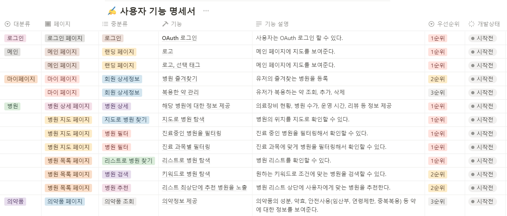

# 1주차

## 02 / 28 (화)
- 기능 명세서 작성

## 03 / 02 (목)

# Hadoop study

맵리듀스가 아닌 Apache Spark를 쓰는 이유

→ 맥리듀스는 슈퍼 컴퓨터 없이 서버를 여러대 연결해 빅데이터 분석을 가능하게 한다. 하지만 기술이 나오고 시간이 한참 지난 뒤 여러 단점이 보였다. 그래서 대안으로 나온 아파치 스파크가 있다.

→ 아파치 스파크는 맵리듀스와 비슷한 목적의 업무를 수행하는데 메모리를 활용한 굉장히 빠른 데이터 처리를 특징으로 가지고 있다.

하둡 → 대용량 데이터를 분산 처리할 수 있는 자바 기반 오픈소스 프레임워크

- 분산저장 기술인 HDFS + 분산처리 기술인 MapReduce
- job을 작은 단위로 분할하고, 이를 클러스트의 모든 노드로 매핑
- 각 노드는 job을 처리한 중간 결과를 생성한다.

분산 프로그래밍 → 여러 디스크로부터 데이터를 한 번에 읽는 것. 병렬로 동작하면 많은 데이터를 빨리 읽을 수 있다.

하둡을 사용하는 이유

- 기존의 RDBMS는 비싼 비용이 들지만 하둡은 오픈소스라 비용이 거의 들지 않는다.
- 분산 컴퓨팅 방식으로 구축 비용이 저렴하며 그 비용 대비 데이터 처리가 굉장히 빠르다.
- 장애를 대비하여 매번 운영한 이후의 결과들을 디스크에 기록하기 때문에 문제가 발생했을 때 기록된 결과들을 활용하여, 그 문제를 파악하고 해결하기 쉽다.

### Apache spark

- 빅데이터 워크로드에 주로 사용되는 분산처리 시스템
- 하둡과 마찬가지로 오픈소스
- 빠른 성능을 위해 인 메모리 캐싱과 최적화된 실행을 사용하고 일반 배치처리, 스트리밍 분석, 머신러닝, 그래프 데이터 베이스 및 임시 쿼리를 지원
- 하둡 없이도 클라우드 기반 데이터 플랫폼과 융합하며 원래는 하둡을 이용한 정보활용을 위한 데이터 프로세싱 툴
- 기존의 하둡을 통해 끌어오는 데이터들은 시간 소요가 크기 때문에 실시간으로 분석해야 하는 업무에는 어려움이 있어 새로 개발됨

(전체의 데이터셋을 한꺼번에 처리)

→ 배치 프로세싱의 경우 하둡의 맵리듀스에 비하여 스파크가 10배 더 빠르고, 인 메모리 애널리틱스의 경우에는 100배 더 빠른 수행 속도를 낸다.

스파크는 스트리밍 데이터 처리와 머신러닝 알고리즘처럼 애플리케이션과의 복합적 운영이 필요할 때 적합

ex) 실시간 마케팅 캠페인, 온라인 상품 추천, 사이버 보안분석

## 03 / 03 (금)
- 기능 명세서 작성 (새로운 주제)

# 2주차

## 03 / 06 (월)
- 기획 PPT 제작 (assets 폴더 업로드)
- 주제 최종 확정
- 병원 관련 주제 기능 명세서 작성
