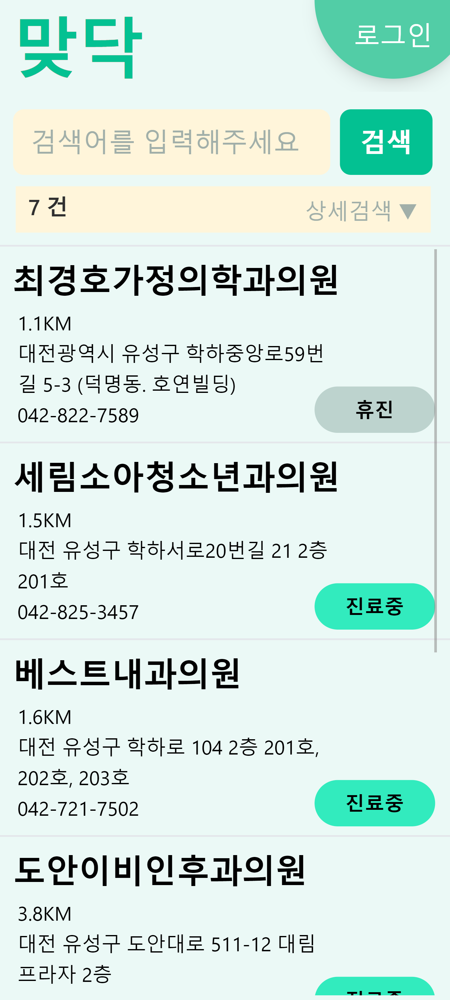
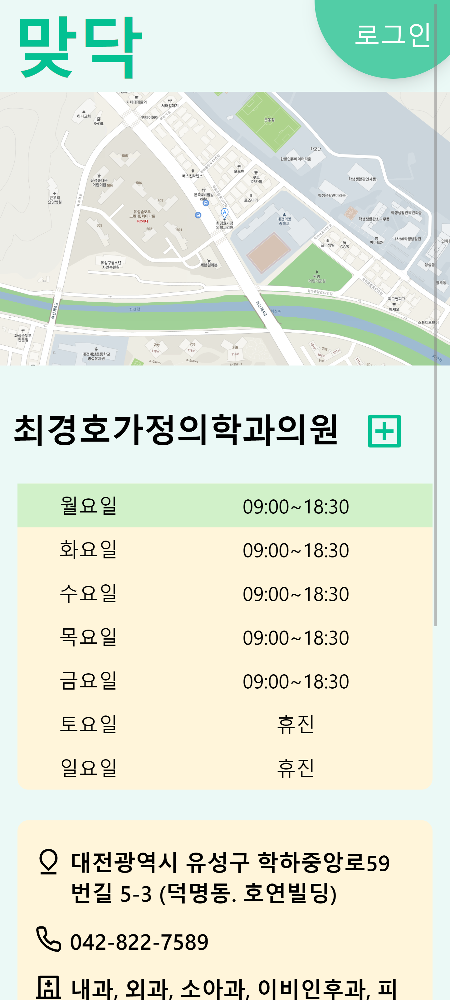
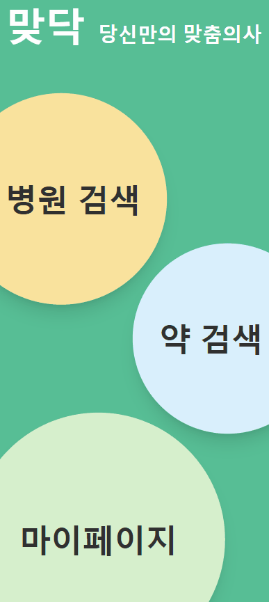
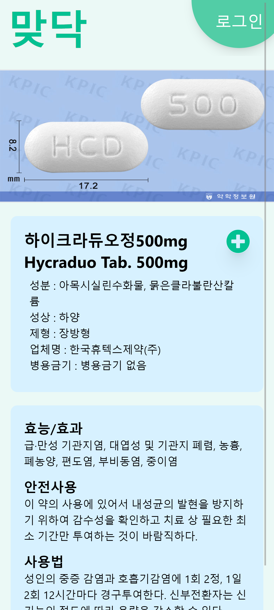
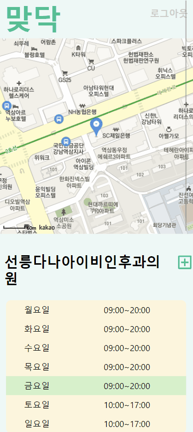
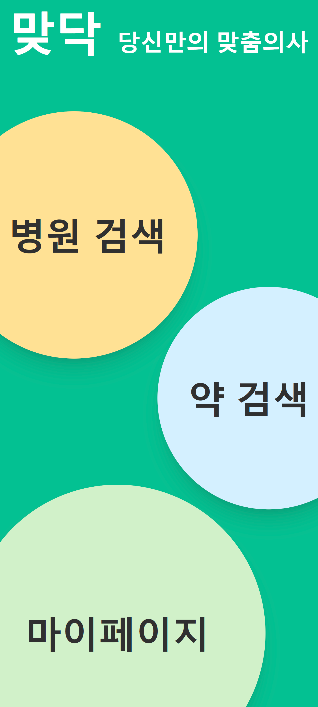
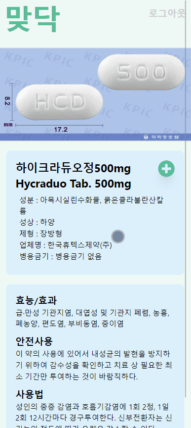

# SSAFY 8기 특화프로젝트 B108 '맞닥'\_ver2

## : 한 눈에 들어오는 메디컬 서비스

 

# ✔ Project Summary

### 👩‍💻개발 기간 : 2023.02.27 ~ 2023.04.07

[🔗 ver1 Repository](https://github.com/pingu2017/matdoc)

팀원

- 권지훈 (팀장) - Back-End, Front-End
- 이승민 - Back-End, ppt
- 조원희 - Back-End, Docs, presentation
- 한인환 - Front-End
- 송기라 - Front-End
- 안효관 - DevOps, Back-End

### 🛠️리팩토링 기간 : 2023.06.05 ~ 2023.07.07

- 권지훈 : 약 관련 부분 Back-End, Front-End
- 조원희 : 병원 관련 부분 Back-End, Front-End

## 리팩토링

어떤 것을했나요?

## 🎥[시연 영상](https://youtu.be/fO9pPNvh4Jg)

 

# ✔ Information

## 메인 기능

- 현 위치에서 **5km 이내에 영업중**인 병원 정보 제공
- **증상에 따른** 병원정보 제공
- 병원 및 의약품의 **자세한** 정보 제공
- 복용중인 **약 관리** 및 병원 **즐겨찾기**
   
   

### 🏣 병원 검색

- 

  
  
  
  

   

### 💊 약 검색

 

### 📑 마이페이지

 

## 기대효과

---

- 아플 때 **신속하게** 원하는 조건의 병원을 찾을 수 있다.
- 의약품의 **성분** 및 **함께 복용하면 안 되는** 약을 확인함으로써 유용하게 **건강을 관리**할 수 있다.
- 병원 및 의약품의 자세한 정보를 **맞닥**에서 **한 번에** 알 수 있다.

 

# 설계 및 산출물

### 🏣 [기획서](./DOCS/맞닥_기획서.md)

### 📜 [기능명세서](./DOCS/기능명세서.md)

### 💾 [ERD](./DOCS/ERD.md)

### 🔑 [DB컬럼설명](./DOCS/DB컬럼설명.md)

### 📡 [API명세서](./DOCS/API명세서.md)

### 🗺 [아키텍쳐설계도](./DOCS/아키텍쳐.md)

### 🏹 [포팅메뉴얼](./DOCS/포팅메뉴얼.md)

### 📺 [시연시나리오](./DOCS/시연시나리오.md)

 
