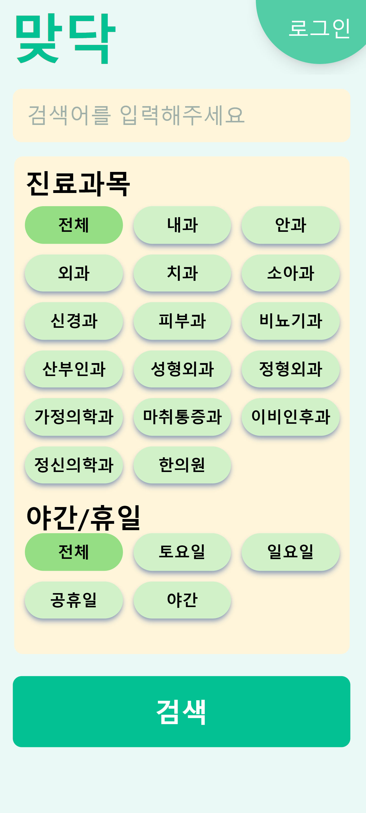
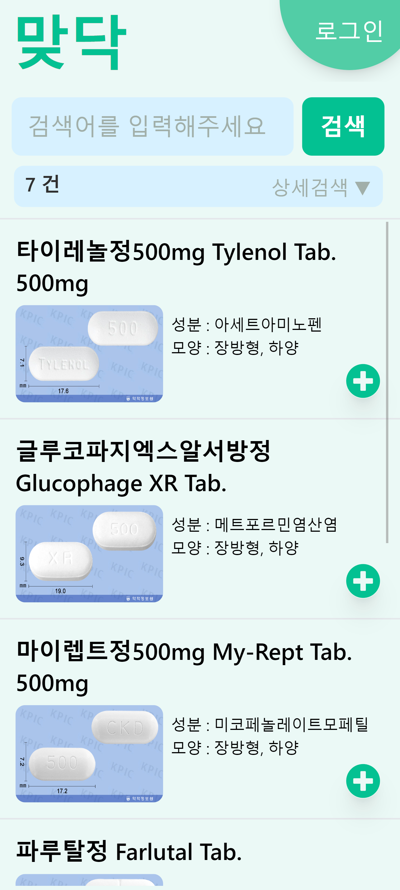
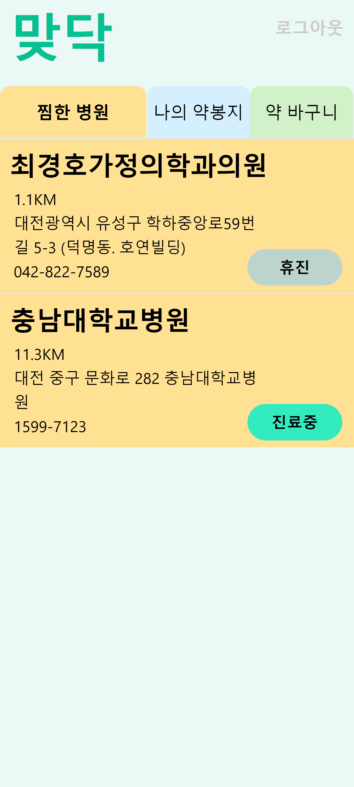
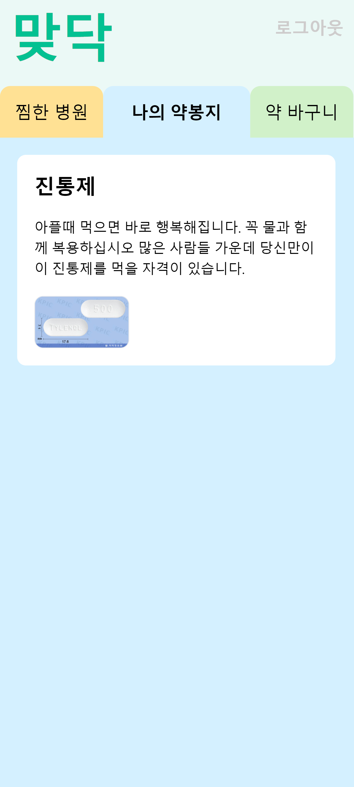
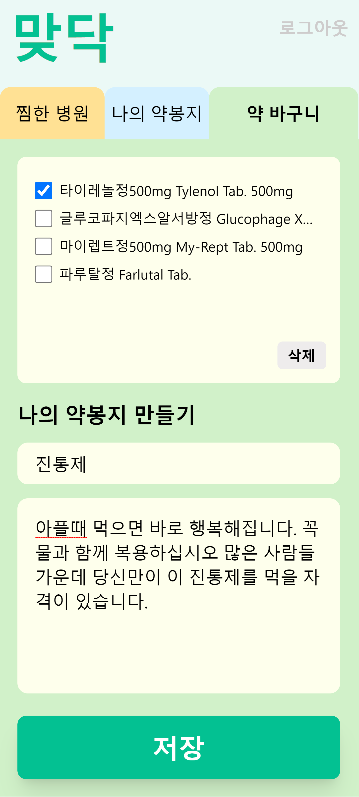

# SSAFY 8기 특화프로젝트 B108 '맞닥'

## : 한 눈에 들어오는 메디컬 서비스

 

# ✔ Project Summary

### 개발 기간 : 2023.02.27 ~ 2023.04.07

### 팀원!
- 권지훈 (팀장) - Back-End, Front-End
- 이승민 - Back-End, ppt
- 조원희 - Back-End, Docs, presentation
- 한인환 - Front-End
- 송기라 - Front-End
- 안효관 - DevOps, Back-End
 
 

---
## 서비스 설명
- 병원을 고를 때 **신뢰성 있는** 병원 및 의약품 정보를 찾기 어려움
- 내가 원하는 **니즈를 충족**하는 병원을 찾기 힘듦
- 한 눈에 들어오는 **메디컬 서비스**

- 증상에 따른 병원을 **필터링**
- **신뢰성** 있는 병원 및 의약품 정보 제공
- **사용자 맞춤** 서비스 제공

 

# ✔ Information

## 메인 기능

- 현 위치에서 **5km 이내에 영업중**인 병원 정보 제공
- **증상에 따른** 병원정보 제공
- 병원 및 의약품의 **자세한** 정보 제공
- 복용중인 **약 관리** 및 병원 **즐겨찾기**
 

## 기대효과

---

- 아플 때 **신속하게** 원하는 조건의 병원을 찾을 수 있다.
- 의약품의 **성분** 및 **함께 복용하면 안 되는** 약을 확인함으로써 유용하게 **건강을 관리**할 수 있다.
- 병원 및 의약품의 자세한 정보를 **맞닥**에서 **한 번에** 알 수 있다.

 

# 설계 및 산출물
## 🏣 [기획서](./DOCS/맞닥_기획서.md)
## 📜 [기능명세서](./DOCS/기능명세서.md)
## 💾 [ERD](./DOCS/ERD.md) 
## 🔑 [DB컬럼설명](./DOCS/DB컬럼설명.md)
## 📡 [API명세서](./DOCS/API명세서.md)
## 🗺 [아키텍쳐설계도](./DOCS/아키텍쳐.md)
## 🏹 [포팅메뉴얼](./DOCS/포팅메뉴얼.md)
## 📺 [시연시나리오](./DOCS/시연시나리오.md)
 

### 배포(CI/CD)

---

- AWS EC2 - ubuntu os 20.04 LTS
- Docker
- k8s (kubeadm)
- Nginx
    - Nginx Ingress controller와 service로 분기처리 및 로드밸런싱
- Jenkins
    - Master/Agent로 병렬 처리
    - pipeline 스크립트 작성으로 CI/CD 적용(GitOps)
- ArgoCD
- https
    - cert-manager + letsencrypte를 통한 인증서 발급
- Grafana + Prometheus

 

# ✔ Cooperation
- Git

- Jira

- Notion

- MatterMost
- Webex
- Discord

